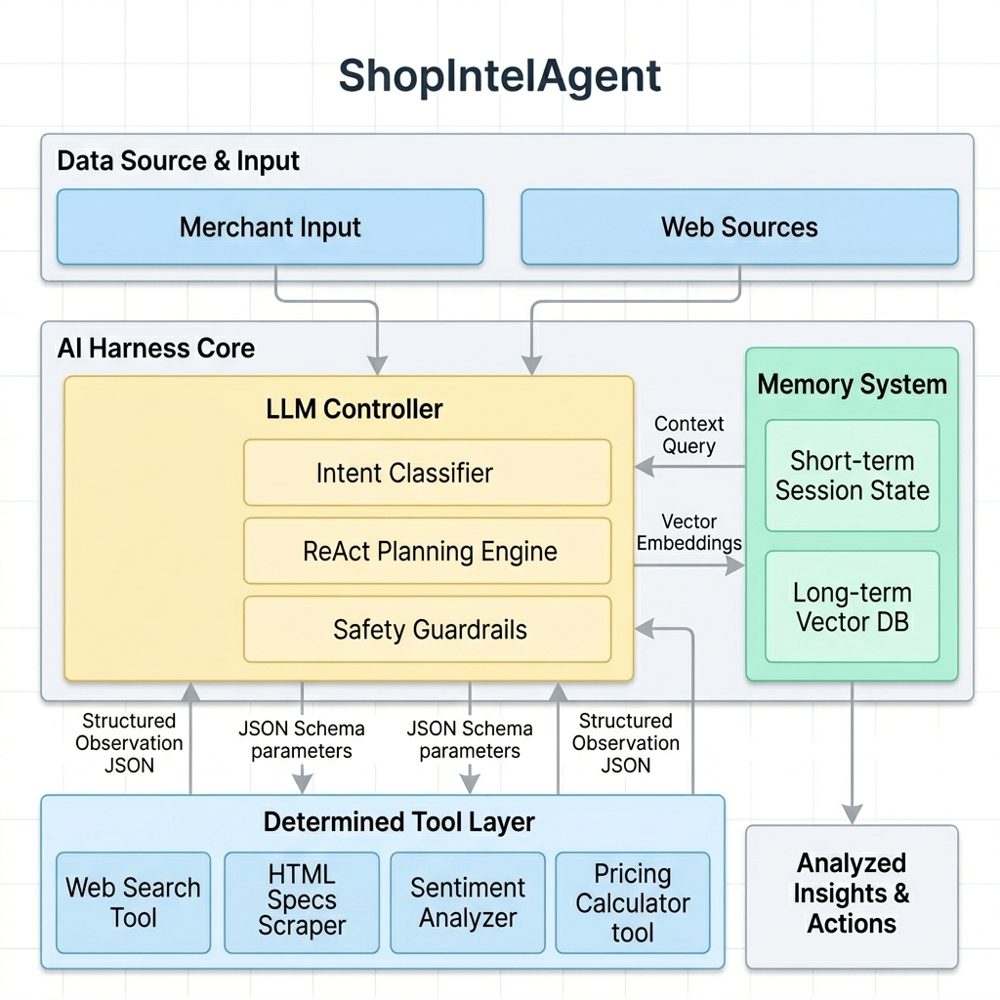

# ShopIntelAgent — 自主電商市場情報與競品定價分析助理

> **課程名稱：深度強化學習與 AI 系統編排 (DRL / AI Harness Systems)**  
> **作業項目：Homework 4 — AI Harness Systems Design and Analysis (Syllabus Version)**  
> **在線演示 (GitHub Pages Demo)**：發布後可直接透過網頁端運行互動模擬。

---

## 📂 倉庫結構與交付項目說明 (Project Structure)

本倉庫包含了作業要求的完整繳交項目與動態 Web 演示系統：

```
├── index.html       # 互動式 Demo 網頁（系統運行模擬儀表板）
├── style.css        # Demo 網頁樣式表（現代化深色科技感設計）
├── script.js        # Demo 網頁前端邏輯（模擬 ReAct 控制台與真實定價計算）
├── report.md        # [必交 1] 2-5頁 A4 規格書面設計報告 (Markdown 格式)
├── report.pdf       # [必交 1] 2-5頁 A4 規格書面設計報告 (PDF 格式，內置字體無亂碼)
├── convert_pdf.py   # 自動將 report.md 轉換為 report.pdf 的 Python 腳本工具
├── infographic.png  # [必交 2] 系統架構、記憶體與工具交互數據流資訊圖表
├── log.md           # [必交 3] AI 輔助設計與兩輪架構迭代過程日誌
└── README.md        # 專案總覽與功能細節說明 (本文件)
```

> **PDF 重新編譯說明**：如果您修改了 `report.md` 的內容，只要在終端機中運行 `python convert_pdf.py`，系統將自動調用 Windows 內建的 Microsoft Edge 瀏覽器，重新編譯並生成最新版的 `report.pdf`。

---

## 📌 專案設計初衷與痛點解決

在競爭激烈的電子商務市場中，賣家（Merchant）需要動態調整價格以維持優勢。傳統人工調查面臨**爬取困難、評論閱讀耗時、算術推理存在幻覺**等硬傷。

**ShopIntelAgent** 展示了如何使用大語言模型（LLM）作為系統控制器，協調多層次記憶體（Memory）與一組確定性的工具（Tools），解決了以下問題：
- **職責分離 (Separation of Concerns)**：LLM 負責定性推理、意圖分類與規劃；Python/JS 工具負責搜尋、網頁抓取與精確定價計算，避開 LLM 數學短板。
- **編排護欄 (Orchestrator Guardrails)**：防止 LLM 在爬蟲失敗或搜尋無結果時陷入死循環，保證商務利潤絕對不受隨機輸出侵蝕。

---

## 💻 互動式 Demo 網頁說明 (Interactive Web Simulator)

我們隨附了一個功能完善、視覺效果卓越的單頁 Web 應用程式（SPA），模擬了整個 AI Harness 的執行軌跡：

### 1. 核心功能特色
- **參數動態輸入**：支持自訂商品名稱、進貨成本、最低毛利率、競品搜尋關鍵字與市場定位策略。
- **ReAct 執行控制台**：以黑底藍字的終端機（Console）樣式，打字機動畫實時輸出 AI Harness 內部的 `Thought -> Action -> Observation` 推理鏈。
- **503 錯誤與 Retry 機制展示**：勾選「模擬網頁爬取失敗（HTTP 503）」後，控制台會動態展現系統編排層檢測到網頁抓取失敗，自動觸發重試（Retry 1/1），最終修復並完成任務的容錯歷程。
- **真實數值運算與價格保護**：計算器工具會讀取您的真實輸入。若設定毛利率過高（例如成本 $25，要求 150% 利潤，使售價達 $62.5，遠高於競品的 $38 - $45），系統會自動觸發**價格保護 Guardrail**，在最終報告中亮起警告黃字，告知已被強制限制或提示銷量風險。

### 2. 本地運行方法
- 直接在瀏覽器中雙擊打開根目錄下的 `index.html` 即可立即運行，無需安裝任何依賴或 Node.js 環境。

---


## 🔍 AI Harness 系統架構細節剖析

本系統設計嚴格遵循現代 AI 編排系統最佳實踐。以下為本專案的系統架構、記憶體與工具交互數據流資訊圖表：



以下為各系統組件的詳細運作機制：

### 1. 系統大腦：LLM System Controller (模型無關設計)
大語言模型（如 GPT-4 / Gemini / Claude 等支援工具調用的模型）接收使用者 Prompt，將其拆解為搜尋、爬蟲、分析與計算的步驟。它不進行最終的定價數字加減乘除，而是生成 JSON 調用參數。

### 2. 工具調用設計 (4 核心工具與 JSON Schema)

#### 工具一：`competitor_search` (競品尋找)
- **輸入參數**：`query` (string, 搜尋詞), `platform` (string: amazon/shopify/all, 平台), `limit` (integer, 限制數)
- **功能**：獲取市場對標網址。

#### 工具二：`extract_product_details` (規格爬蟲)
- **輸入參數**：`url` (string, 競品商品詳細頁面)
- **功能**：由 Harness 執行爬網與 HTML 過濾，僅回傳乾淨的商品 Title、Price 與評論樣本給 LLM，最大化減少 Context Window 的消耗。

#### 工具三：`analyze_reviews_sentiment` (評論情感分析)
- **輸入參數**：`reviews` (array of strings, 評論內容列表)
- **功能**：從使用者回饋中精確提取「Pros（優點）」與「Cons（痛點）」，挖掘市場未滿足缺口（Market Gap）。

#### 工具四：`pricing_strategy_calculator` (定價策略計算器)
- **輸入參數**：
  ```json
  {
    "cost": 25.00,
    "min_margin": 0.20,
    "competitor_prices": [45.99, 38.50],
    "positioning": "mid_range"
  }
  ```
- **功能**：**【確定性防護網】**。使用精確的程式算法計算最低毛利允許售價（`Cost * (1 + Margin)`）、競品中位數與均價，並根據定位（平價/中階/高檔）回傳最終定價區間。

---

## 🛡️ 編排決策表與安全防護網 (Orchestrator Guardrails)

為避免 LLM 的隨機性導致系統崩潰，Harness 編排層實施了下述保護機制：

- **重試機制 (Retry Fallback)**：當網頁爬取工具因網站防爬或連線逾時報錯時，編排層自動捕獲錯誤並觸發一次 Retry。若仍失敗，會將該網址標記為無效，引導 LLM 調用下一個競品。
- **利潤安全護欄 (Margin Protection)**：任何工具生成的建議定價均須通過商務公式檢驗：`Price >= Cost * (1 + Margin)`。若計算器返回數值低於此線，系統會強制阻斷，將售價修正為毛利底線，並在報告中打上安全標記。
- **強制終止條件 (Termination Boundary)**：為了防止 LLM 因找不到資料在「搜尋-失敗」中反覆調用，編排層限制單次任務中**工具呼叫上限為 10 次**。一旦超出，立即中斷並整合現有資料生成保守報告。

---

## 📊 Evaluation 評量設計說明

本系統提供了一個嚴謹的評量體系來測試 Harness 的穩定性：
- **30 筆測試案例基準集**：
  1. *資訊缺失情境*：測試輸入漏填成本時，LLM 是否能主動追問（預期工具序列應為空）。
  2. *標準情境*：驗證工具呼叫鏈是否為 `Search` $\rightarrow$ `Extract` $\rightarrow$ `Analyze` $\rightarrow$ `Calculate`。
  3. *異常防禦情境*：模擬爬蟲遭遇阻擋，驗證 Retry 機制與跳過邏輯是否正確執行。
- **量化指標**：
  - **工具路徑正確率**：目標 $\ge 90\%$。
  - **利潤合規率**：建議零售價必須 100% 滿足商家最低利潤率，容錯率為 0%。
  - **規格抽取 $F_1 \text{-score}$**：目標 $\ge 85\%$。
