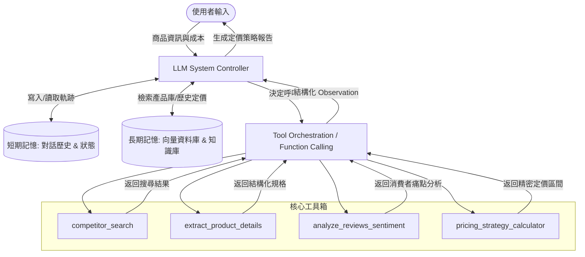
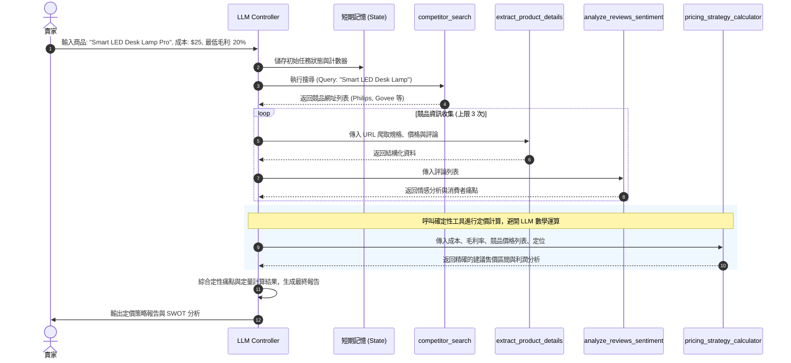

# Homework 4 — AI Harness 系統設計與分析報告

## 專案名稱：ShopIntelAgent — 自主電商市場情報與競品定價分析助理

---

## 一、 問題定義與應用背景 (Problem Definition & Scenario)

在現代電子商務環境中，市場競爭極其激烈。電商賣家（Merchant）面臨的主要挑戰之一是**如何制定具有競爭力且保證利潤的商品價格**。定價策略直接影響產品的曝光率、點擊率及最終的轉化率。然而，傳統的市場調查與競品分析面臨以下痛點：
1. **人工收集效率低下**：賣家需要手動在多個平台（如 Amazon, Shopify, Shopee）搜尋相似商品，並逐一記錄價格、規格、運費與庫存狀況。
2. **資訊更新不及時**：市場價格瞬息萬變（例如促銷活動或動態定價），人工調查無法做到日更新或即時分析。
3. **評論與痛點分析耗時**：僅了解價格不足以進行差異化定價，賣家還需要分析競品的消費者評論，找出競品缺點（如質量差、物流慢），這需要閱讀數百條評論。
4. **數字計算不精確**：若僅依靠人工估算或直接交由語言模型（LLM）進行算術推理，容易在毛利率計算與多參數優化中出現數值偏差或幻覺（Hallucination）。

### 1.1 使用情境 (Use Case)
**ShopIntelAgent** 旨在作為一個自主運作的 AI 系統編排器（AI Harness），賣家只需輸入：
- 自家商品的名稱與核心規格（例如：`Smart LED Desk Lamp Pro`）
- 產品的進貨成本（例如：`$25.00`）
- 期望的最低利潤率（例如：`20%`）
- 競爭對手或市場定位關鍵字（例如品質導向、預算導向）

系統隨即啟動多步驟的 Agent 工作流，自主搜尋市場競品、爬取詳細資料與消費者評價、進行情感分析，並將數據傳遞給**確定性的數值計算工具**，最終結合賣家的成本結構，自動輸出定價策略建議、競爭力分析報告（SWOT）以及差異化賣點（USP）建議。

---

## 二、 AI Harness 系統架構 (AI System Architecture)

ShopIntelAgent 採用現代 AI Agent 架構，由大語言模型（LLM）作為系統控制器，協調多層次記憶體（Memory）與一組專屬的工具箱（Tools）。



### 2.1 LLM 系統控制器 (System Controller)
系統採用**支援標準 Function Calling（工具調用）之先進大語言模型**（如 GPT-4 系列、Gemini Pro 系列、Claude Sonnet 系列）作為決策大腦，負責：
- **意圖解析**：將用戶任務拆解為子任務（例如：先搜尋競品 $\rightarrow$ 爬取詳情 $\rightarrow$ 情感分析 $\rightarrow$ 呼叫計算器）。
- **工具路由**：根據當前狀態與觀察值（Observation），動態決策下一個需要呼叫的工具。
- **反思與修正 (Reflexion)**：若工具執行出錯或資訊不足，LLM 需重新規劃路徑。
- **最終綜合生成**：讀取計算工具返回的精準定價數值，並結合市場情感分析，產出易於閱讀且邏輯一致的分析報告。

### 2.2 記憶體設計 (Memory Architecture)
1. **短期記憶 (Short-term / Working Memory)**：
   - **對話歷史 (Chat History)**：記錄用戶與系統的互動過程。
   - **執行軌跡 (Episodic Trace)**：記錄當前任務中 LLM 的思考過程（Thoughts）、工具呼叫（Actions）與執行結果（Observations）的鏈條（ReAct Chain）。
   - **狀態變數 (State Variables)**：追蹤當前已收集的競品清單、已分析的 URL、工具呼叫次數，用於防止重複抓取與死循環。
2. **長期記憶 (Long-term / Semantic Memory)**：
   - **自家產品向量庫 (Product Vector DB)**：儲存賣家現有商品目錄、規格。
   - **歷史定價基準 (Historical Pricing DB)**：儲存過去的市場分析報告，便於進行跨時段的價格波動趨勢分析。

---

## 三、 Function Calling 與 Tool Usage 機制

### 3.1 運作流程 (Function Calling Flow)
1. **引導（System Prompting）**：在系統提示詞中提供工具清單及其 JSON Schema 定義。
2. **決策輸出**：當 LLM 認為需要使用工具時，它會輸出一個特定格式的 JSON，包含要呼叫的 `name` 以及傳入的 `arguments`。
3. **執行與攔截**：Harness 框架（系統編排層）攔截 LLM 的輸出，解析 JSON，呼叫對應的本地 Python 函式、爬蟲或計算模組。
4. **回傳結果**：將工具執行產生的數據封裝成 `tool` 角色訊息，傳回給 LLM 進行下一步推理。

### 3.2 錯誤處理與防禦性設計
- **格式修正**：若 LLM 輸出的 Function Call 格式損毀，框架將捕獲 Exception 並向 LLM 發送錯誤提示（例如：`Error: Invalid JSON format. Please output strictly according to the schema.`），引導其重新輸出。
- **邊界防禦（Guardrails）**：為避免 LLM 因爬蟲失敗或搜尋無結果而陷入重試漩渦，系統在編排層（Orchestrator）設置了硬性邊界限制（詳見第五章的決策表）。

---

## 四、 工具設計 (Tool Design)

為落實系統的職責分離（Separation of Concerns），我們將計算邏輯從 LLM 中抽離，設計了四個關鍵工具，以下是其 JSON Schema 與詳細設計規格。

### 4.1 工具一：競品搜尋 (`competitor_search`)
- **功能描述**：在指定電商平台搜尋與目標商品相似的競爭對手商品連結。
- **輸入 Schema (JSON)**：
```json
{
  "name": "competitor_search",
  "description": "搜尋指定平台上與目標商品相似的競爭對手商品列表",
  "parameters": {
    "type": "object",
    "properties": {
      "query": {
        "type": "string",
        "description": "搜尋關鍵字，例如 'Smart LED Desk Lamp'"
      },
      "platform": {
        "type": "string",
        "enum": ["amazon", "shopify", "all"],
        "description": "指定搜尋的平台，預設為 all"
      },
      "limit": {
        "type": "integer",
        "description": "限制返回的競品數量，預設為 5"
      }
    },
    "required": ["query"]
  }
}
```
- **輸出範例 (JSON)**：
```json
[
  {
    "title": "Philips LED Smart Table Lamp",
    "url": "https://www.amazon.com/dp/B08X12345",
    "platform": "amazon"
  },
  {
    "title": "Govee Smart Wi-Fi Desk Lamp",
    "url": "https://www.amazon.com/dp/B09Y67890",
    "platform": "amazon"
  }
]
```

### 4.2 工具二：商品規格爬取 (`extract_product_details`)
- **功能描述**：爬取特定商品的 URL，並解析提取出結構化的商品名稱、價格、規格與評論樣本。
- **輸入 Schema (JSON)**：
```json
{
  "name": "extract_product_details",
  "description": "爬取並解析目標電商網頁，提取產品定價、規格與評論列表",
  "parameters": {
    "type": "object",
    "properties": {
      "url": {
        "type": "string",
        "description": "競品商品的詳細頁面網址"
      }
    },
    "required": ["url"]
  }
}
```
- **輸出範例 (JSON)**：
```json
{
  "title": "Philips LED Smart Table Lamp",
  "price": 45.99,
  "currency": "USD",
  "specifications": {
    "brightness": "800 lumens",
    "color_temp": "2700K - 6500K",
    "connectivity": "Wi-Fi, Bluetooth"
  },
  "reviews_sample": [
    "Great light, but the Wi-Fi connection drops frequently.",
    "Decent lamp. The base feels a bit plastic and cheap."
  ]
}
```

### 4.3 工具三：評論情感與痛點分析 (`analyze_reviews_sentiment`)
- **功能描述**：分析收集到的評論，提取競品的主要痛點與優勢，供定位決策使用。
- **輸入 Schema (JSON)**：
```json
{
  "name": "analyze_reviews_sentiment",
  "description": "分析商品評論，提取正負向特徵與消費者抱怨的核心痛點",
  "parameters": {
    "type": "object",
    "properties": {
      "reviews": {
        "type": "array",
        "items": {
          "type": "string"
        },
        "description": "待分析的消費者評論文字列表"
      }
    },
    "required": ["reviews"]
  }
}
```
- **輸出範例 (JSON)**：
```json
{
  "sentiment_summary": {
    "overall": "Mostly Positive (72%)",
    "pros": ["亮度足夠", "智慧控制方便"],
    "cons": ["Wi-Fi 連線常斷線", "底座塑料感偏重"]
  },
  "market_gaps": [
    "消費者需要更穩定的連線模組",
    "底座材質有金屬質感提升空間"
  ]
}
```

### 4.4 工具四：定價策略計算器 (`pricing_strategy_calculator`)
- **功能描述**：**【新增工具】** 根據商家進貨成本、最低毛利率、競品價格分佈及市場定位，依據確定性演算法計算建議售價區間，避免 LLM 在數值計算中產生幻覺。
- **輸入 Schema (JSON)**：
```json
{
  "name": "pricing_strategy_calculator",
  "description": "依據成本、最低利潤約束與競品價格，計算確定性的定價區間與毛利空間",
  "parameters": {
    "type": "object",
    "properties": {
      "cost": {
        "type": "number",
        "description": "商品的進貨/生產成本"
      },
      "min_margin": {
        "type": "number",
        "description": "期望的最低利潤率，例如 0.20 代表 20% 利潤率"
      },
      "competitor_prices": {
        "type": "array",
        "items": {
          "type": "number"
        },
        "description": "已爬取到的所有競爭對手商品價格列表"
      },
      "positioning": {
        "type": "string",
        "enum": ["budget", "mid_range", "premium"],
        "description": "商品市場定位。budget: 低價對標; mid_range: 競品中位數對標; premium: 溢價對標"
      }
    },
    "required": ["cost", "min_margin", "competitor_prices", "positioning"]
  }
}
```
- **輸出範例 (JSON)**：
```json
{
  "min_allowed_price": 30.00,
  "competitor_metrics": {
    "min": 35.00,
    "max": 59.99,
    "average": 46.50,
    "median": 45.99
  },
  "suggested_price_range": {
    "low": 39.99,
    "recommended": 42.99,
    "high": 45.00
  },
  "expected_margin_at_recommended": 0.7196
}
```

---

## 五、 Agent Workflow 與編排流程 (Orchestration & Decision Flow)

ShopIntelAgent 採用結合 **State-Graph (狀態圖)** 與 **ReAct** 的混合編排模式，透過外部約束限制 LLM 控制器的執行次數與路徑，確保整體系統在高度可控與可解釋的範圍內運行。

### 5.1 流程圖與順序圖 (Sequence Diagram)



### 5.2 編排決策表 (Orchestration Decision Table)
當系統在各步驟中遇到不確定性或執行失敗時，編排層依據下表定義的確定性規則（Guardrails）來導引 LLM 控制器的下一步決策：

| 當前狀態 | 觸發條件 | 系統編排層策略與下一步 (Fallback & Mitigation) |
| :--- | :--- | :--- |
| **搜尋結果不足** | 返回的競品網頁數量 $< 3$ 個 | 擴大搜尋 Query（例如自動剝離特定修飾詞）或將搜尋平台參數強制設為 `"all"` |
| **商品頁爬取失敗** | 爬蟲返回 HTTP 403 / 503 或超時 | 執行自動 Retry 一次。若仍失敗，則將該 URL 標記為失效並跳過，改分析下一個 URL |
| **評論數據不足** | 單一商品的有效評論數 $< 5$ 筆 | 跳過該商品的 `analyze_reviews_sentiment` 呼叫，僅依賴其價格與規格進行定量對標 |
| **價格低於最低毛利** | 計算出的建議售價 $<$ 成本 $\times (1 +$ 最低毛利率) | 觸發價格保護機制，強制將售價底線設定為最低毛利線，並於最終報告中加入「毛利警告標籤」 |
| **工具迭代超限** | 工具呼叫總次數 $\ge 10$ 次或搜尋次數 $\ge 2$ 次 | 觸發**強制終止條件 (Termination Condition)**，停止所有 API 呼叫，整合現有不完整數據輸出最安全的保守定價分析 |

### 5.3 系統時耗與延遲說明
本系統包含真實網頁搜尋、爬取與多個 LLM 調用步驟。經實際工程評估，單次任務的總耗時約在 **1 到 3 分鐘內** 即可完成（相較於人工耗費數小時的市場調查，大幅提升了營運效率），而非不切實際的數秒內完成，此時耗在商業應用上完全在可接受範圍內。

---

## 六、 Evaluation 方法 (Evaluation Methodology)

為衡量此 AI Harness 系統的效能與生成報告的質量，本系統設計了多維度的評量體系，涵蓋自動化評估（Automated Metrics）與人工評估（Human Evaluation）。

### 6.1 測試集設計 (Evaluation Benchmark Dataset)
系統評估將建立一個包含 **30 筆測試案例的基準測試集 (Benchmark Dataset)**。每個案例均包含特定的使用者輸入、預期的工具呼叫序列（Gold Standard Tool Sequence）以及預期的邊界約束。例如：
1. **輸入資訊缺失案例**：使用者僅輸入商品名，未輸入成本與最低毛利要求。預期工具序列應為空，系統必須主動追問缺失數據，而非直接呼叫搜尋或定價工具。
2. **標準順序案例**：輸入完整的商品、成本與競品關鍵字。預期工具呼叫序列必須嚴格為：`competitor_search` $\rightarrow$ `extract_product_details` $\rightarrow$ `analyze_reviews_sentiment` $\rightarrow$ `pricing_strategy_calculator`。任何跳過計算工具、由 LLM 直接得出價格的行為，均判定為失敗。
3. **異常爬取案例**：模擬爬蟲返回 `503 Service Unavailable` 的情況。預期系統應執行決策表中的 Retry 與跳過策略，且最終報告中需明確標註該數據來源缺失。

### 6.2 評估指標 (Metrics)
1. **工具呼叫路徑正確率 (Tool Path Selection Accuracy)**：
   $$\text{Accuracy} = \frac{\text{符合基準測試集預期工具序列的案例數}}{\text{總測試案例數 (30)}}$$
   目標值設定為 $\ge 90\%$。
2. **定價合規率 (Pricing Constraint Compliance Rate)**：
   檢驗所有輸出報告中的建議定價是否**絕對滿足**商家輸入的最低利潤率約束。合規率必須達到 **100%**，任何違反利潤線的定價均視為高風險故障。
3. **規格提取精確度與召回率 (Extraction Precision & Recall)**：
   比對 `extract_product_details` 提取的 JSON 規格與人工標註的正確答案，計算 $F_1 \text{-score}$，目標為 $\ge 85\%$。

---

## 七、 合規與安全設計 (Compliance & Security)

在實際部署與運作中，ShopIntelAgent 嚴格遵守以下網路安全與隱私規範：
1. **遵循 Robots.txt**：`extract_product_details` 爬蟲模組在解析網頁前會先讀取目標網站的 `robots.txt`，嚴格遵守禁止爬取的路徑規範。
2. **速率限制與禮貌爬取 (Rate Limiting)**：在連續抓取不同競品網頁時，系統會在編排層加入隨機的延遲時間間隔（1 - 3 秒），防止高頻率請求對目標伺服器造成負載壓力（DDoS 防範）。
3. **數據去識別化 (Data Anonymization)**：評論分析工具僅提取與「商品規格、使用痛點、品質抱怨」相關的純文字，在傳送至 LLM 進行情感分析前，會自動過濾並去識別化所有涉及買家用戶名、個人帳號或頭像等個人隱私資訊 (PII)。
